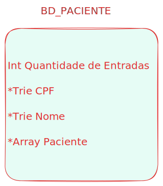
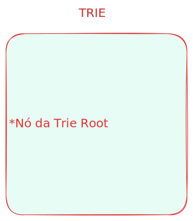
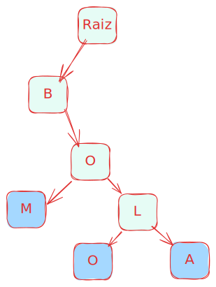
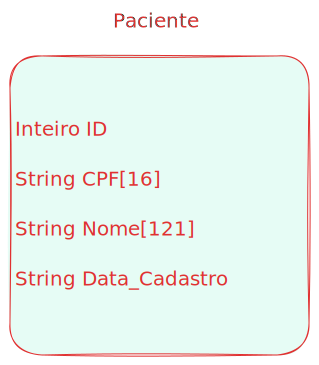

# Trabalho de Estrutura de Dados


**Membros: Heitor Lima Peixoto e Gian Lucca Decoté Paneto Neves**

# Como rodar o projeto
#### 1. Clonar o repositório
Para rodar o projeto em um ambiente Linux, faça o clone do repositório com: 

```git clone https://github.com/Hei-Lima/trabalhoed.git```

#### 2. Rodar o projeto
O arquivo 'Makefile' na raiz do projeto tem diversas keywords que trivializam a execução do programa. Mas, para isso, você vai ter que instalar o Make.

Para simplesmente executar o programa, na raiz do projeto execute o comando:

```make run```

Para apagar os arquivos gerados na hora da compilação, execute o comando:

```make clean```

Para testar o programa para erros de memória com o [Valgrind](https://pt.wikipedia.org/wiki/Valgrind), execute:

```make valgrind```

#### 3. Mudar o CSV carregado.
Você pode gerar pacientes e CSVs aleatórios com o programa em Python (feito por IA, não nos cobre se tiver errado) em `/misc`.

Para trocar o CSV que o programa irá carregar, altere o #define CSV_PATH no arquivo `main.c`. 

# Arquitetura geral

Tentamos deixar o máximo abstrato possível. O DB não tem acesso ao TrieNode e a main não tem acesso a Pacientes nem a nada relativo às implementações do banco de dados. Todas as funcionalidades de módulos importados são invocadas por chamadas de função, nunca por modificação dos objetos em si. Tudo fica bem simples e transparente. A ideia foi fazer na main uma arquitetura modular que imite uma página HTML, onde cada função seria uma página diferente, e as funcionalidades da página são implementadas por funções externas, como o módulo UI Lib.

# Como o programa funciona?

A primeira coisa que o programa faz é carregar os dados de um CSV para o Banco de Dados, que é implementado em um módulo db.c.

O banco de dados tem a seguinte estrutura:



Uma [trie](https://pt.wikipedia.org/wiki/Trie) de CPFs, outra trie de nomes, um [array](https://pt.wikipedia.org/wiki/Arranjo_(computa%C3%A7%C3%A3o)) de estruturas de paciente e um inteiro com a quantidade de pacientes.

Esse banco é implementado com uma estrutura chamada BD_Paciente, que armazena os ponteiros para as tries, o array e o inteiro.

Os motivos que levaram à escolha dessas estruturas e como cada uma funciona serão explicados abaixo.

# Tries
As tries, também conhecidas como árvores de prefixo, foram escolhidas justamente por serem muito rápidas pesquisando por prefixos. O professor da disciplina de Matemática Discreta citou brevemente elas e achamos que isso seria muito interessante para a funcionalidade de buscar por pessoas.

A trie foi implementada no arquivo 'trie.c', juntamente com suas funções e seus nós. A implementação foi inspirada por um vídeo do [YouTube](https://www.youtube.com/watch?v=3CbFFVHQrk4), mas esse vídeo não possui a implementação de várias funções que precisamos para implementar funcionalidades chave. A trie foi implementada assim:



Apenas um ponteiro para o nó da trie root. O vídeo não implementa desse jeito, mas preferimos abstrair e guardar o ponteiro raiz da trie em uma estrutura separada, deixando mais seguro e aumentando a facilidade de implementação em outros códigos.

O nó da trie (o importante) é implementado assim:


A trie é uma árvore que tem n filhos (guardados num array), e cada filho representa uma letra. Cada filho é mapeado num array de 256 possibilidades (tabela ASCII), e um nó pode ter a flag *é folha*, o que representa que aquela combinação é uma palavra completa. A flag índice mapeia o índice da palavra que o nó representa com o ID do paciente no array paciente do BD.

  
 _nós verdes representam nós normais e nós azuis são folhas_

A trie é implementada de forma não otimizada, então ela está gastando memória para dedeu (todo nó VAI TER 256 filhos alocados, mesmo que sejam inicializados com NULL) e o uso de índices significa que, no caso dos nomes, que não são únicos, um nome repetido iria sobrescrever o índice, e isso é uma issue conhecida que vai ser corrigida em uma próxima versão. Eu também tive que fazer uma referência circular que não me agradou (db->trie e trie->db). Ela aloca 256 caracteres mapeados para a tabela ASCII, mas aceita outros tipos de tabelas de caracteres em suas pesquisas, causando comportamento inesperado.

## Qual o motivo de ter duas tries?

Simples: cada trie armazena uma sequência, então a redundância foi necessária para armazenar os números do CPF e os nomes.

## Qual o motivo de usar uma trie?

A trie permite a busca de forma mais eficiente (temporalmente, mas pode perder em memória). Enquanto uma busca em um array seria sequencial e tem complexidade O(n) (precisa-se buscar em todos os itens do array), a trie busca em O(m) (apenas o comprimento da string). Ou seja, ela escala muito melhor!

# Array paciente

O array paciente é um array dinamicamente alocado (aloca na execução do programa o número de pacientes do CSV). Ele armazena estruturas paciente.



Nada de muito interessante aqui. Essas informações são retiradas do CSV, parseadas com scanf() (ISSO foi difícil...) e colocadas no array e nas tries. O problema da linguagem C é ter que alocar memória, então o tamanho máximo dos nomes é o número de caracteres no nome de [Pedro II](https://pt.wikipedia.org/wiki/Pedro_II_do_Brasil). 

O banco de dados trabalha com a lógica de fazer as consultas e relacionar as tries com os pacientes do array.

# Módulo UI Lib

Esse módulo implementa tudo relativo à formatação de prints e inputs dos usuários. Nele, implementamos a função ui_cls() que limpa a tela e ui_get_char(), que pega um caractere apenas em tempo real, usando modo [não canônico do terminal](https://stackoverflow.com/questions/13104460/confusion-about-raw-vs-cooked-terminal-modes) (raw).

# Testes

Os testes são feitos rodando o Valgrind, para checar por erros de memória. Isso garante que todos os frees foram executados corretamente e não sobraram ponteiros se balançando por aí.

# PS:
### Perdão pelos comandos estranhos na hora de escrever a consulta, não conseguimos algo mais esperto.

### Tente pesquisar o seu nome... Ele está lá! Os nossos também.